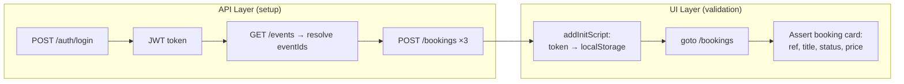
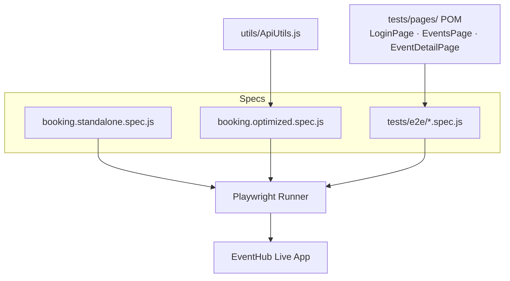
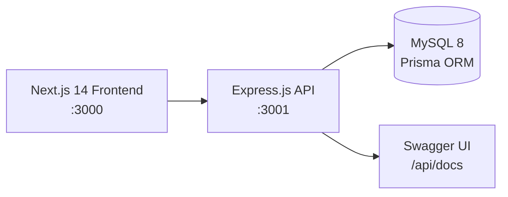

# EventHub — Playwright UI + API Hybrid Test Framework

[](https://github.com/samirjagtap4030/eventhub-playwright-ui-api-framework/actions/workflows/playwright.yml)
[](https://playwright.dev/)
[](https://nodejs.org/)
[](https://www.docker.com/)
[](#prerequisites)
[](LICENSE)

A **UI + API hybrid test automation framework** built with **Playwright**, tested against the EventHub ticket-booking application. Test data is created through the **API layer** (login, token, bookings) and validated through the **UI layer** — cutting execution time and flakiness compared to pure-UI tests.

The repo also bundles the EventHub application source (`backend/` + `frontend/`) so the app can be run locally, though the test suites currently target the **live deployment**.

---

## Table of Contents

- [Overview](#overview)
- [Tech Stack](#tech-stack)
- [Architecture](#architecture)
- [Prerequisites](#prerequisites)
- [Quick Start](#quick-start)
- [Running Tests](#running-tests)
- [Test Coverage & ROI](#test-coverage--roi)
- [Folder Structure](#folder-structure)
- [Docker](#docker)
- [CI — GitHub Actions](#ci--github-actions)
- [MCP Servers](#mcp-servers)
- [Agent Workflow (Claude Code Skills)](#agent-workflow-claude-code-skills)
- [Live Demo / Test Target](#live-demo--test-target)
- [Troubleshooting](#troubleshooting)
- [Author](#author)
- [License](#license)

---

## Overview

This project demonstrates a two-part hybrid testing approach for the booking flow:

1. **Standalone spec** (`booking.standalone.spec.js`) — every test case written end-to-end in one file: API login → API booking creation → UI validation. Simple to read, but with repeated setup code.
2. **Optimized spec** (`booking.optimized.spec.js` + `utils/ApiUtils.js`) — all API setup extracted into a reusable `ApiUtils` class, run **once** in `beforeAll`, with tests doing pure UI validation. Login is bypassed by injecting the API token into `localStorage` via `addInitScript`.

On top of that:
- **Classic E2E suite** (`tests/e2e/`) with Page Object Model (`tests/pages/`)

## Tech Stack

| Layer | Technology |
|---|---|
| Test runner | Playwright 1.58 (Chromium) |
| Language | JavaScript (ES modules), TypeScript config |
| Design patterns | Page Object Model, API utility class, token injection |
| CI | GitHub Actions (`playwright.yml`) |
| Containerization | Docker + docker-compose (Playwright official image) |
| App under test | Next.js 14 + Express.js + Prisma + MySQL 8 (live deployment) |

## Architecture

### Hybrid UI + API test flow



### Framework layers



### Application under test



## Prerequisites

- **Node.js 18+** (CI uses Node 24)
- **npm**
- (optional, local app only) **MySQL 8+**
- (optional) **Docker Desktop** — to run tests in a container

Works on Windows, Linux, and macOS.

## Quick Start

```bash
# 1. Clone
git clone https://github.com/samirjagtap4030/eventhub-playwright-ui-api-framework.git
cd eventhub-playwright-ui-api-framework

# 2. Install root deps (Playwright)
npm install

# 3. Configure test-user credentials
cp .env.example .env
# fill in TEST_USER_EMAIL / TEST_USER_PASSWORD / TEST_USER2_EMAIL

# 4. Install browsers
npx playwright install chromium

# 5. Run the hybrid framework tests
npx playwright test tests/booking-ui-api-framework/booking.optimized.spec.js
```

Tests run against the live app by default (`playwright.config.ts` → `baseURL`), so no local app setup is needed to run them.

<details>
<summary>Optional: run the app locally (backend + frontend)</summary>

```bash
npm run setup        # install backend + frontend deps
# create MySQL DB and configure backend/.env (DATABASE_URL, JWT secret)
npm run db:push      # push Prisma schema
npm run seed         # seed static events + test user
npm run dev          # API on :3001, frontend on :3000
```
</details>

## Running Tests

```bash
# All Playwright tests (headless)
npm run test

# Interactive UI mode
npm run test:ui

# Hybrid framework — standalone vs optimized
npx playwright test tests/booking-ui-api-framework/booking.standalone.spec.js --headed
npx playwright test tests/booking-ui-api-framework/booking.optimized.spec.js --headed

# Classic E2E (POM-based)
npx playwright test tests/e2e/

# Open last Playwright HTML report
npm run test:report
```

Test configuration (`playwright.config.ts`): single worker, sequential execution, 120s test timeout, screenshot on failure, HTML reporter.

## Test Coverage & ROI

| Suite | Tests | What it proves |
|---|---|---|
| `booking.standalone.spec.js` | 8 | Full hybrid flow, self-contained per test |
| `booking.optimized.spec.js` | 8 | Same coverage, shared API setup via `ApiUtils` |
| `tests/e2e/` (POM) | 6 | Classic UI E2E + pure API checks |

Covered cases include: single/multi-ticket booking, price × quantity math, booking reference format, static-event per-user seat isolation, cross-user booking visibility (two authenticated users).

### Standalone vs Optimized — comparison

| Metric | Standalone | Optimized | Gain |
|---|---|---|---|
| Spec size | 248 lines | 159 lines (+96 reusable `ApiUtils`) | ~36% smaller spec |
| API setup calls | Repeated inline per flow | Once, via `ApiUtils.createBookings()` | Reusable across suites |
| Login | API token per flow | Token injected via `addInitScript` (zero UI logins) | No login UI time/flakiness |
| Maintainability | Endpoint change → edit every block | Endpoint change → edit `ApiUtils` only | Single point of change |

### Why hybrid (UI+API) beats pure-UI

| | Pure UI test | Hybrid UI+API test |
|---|---|---|
| Data setup | Click through login + event + form (~30–60s per test) | 3–4 API calls (~1–2s total) |
| Flakiness | High (every setup step can flake) | Low (only the assertion page is UI) |
| Failure signal | "Something in the long flow broke" | Pinpoints UI display vs API data issues |

## Folder Structure

```
eventhub-playwright-ui-api-framework/
├── .github/workflows/playwright.yml # CI — Playwright on push to main
├── backend/                         # Express + Prisma app source (optional local run)
├── frontend/                        # Next.js app source (optional local run)
├── tests/
│   ├── booking-ui-api-framework/    # ⭐ hybrid UI+API framework
│   │   ├── booking.standalone.spec.js
│   │   ├── booking.optimized.spec.js
│   │   └── utils/ApiUtils.js
│   ├── e2e/                         # classic E2E + API specs
│   └── pages/                       # Page Object Model
├── playwright.config.ts
├── Dockerfile / docker-compose.yml
└── package.json
```

## Docker

Run the whole suite inside the official Playwright image — no local browser install needed:

```bash
docker compose up --build
```

- Image: `mcr.microsoft.com/playwright:v1.58.2-noble`
- HTML report and failure screenshots are volume-mapped back to `playwright-report/` and `test-results/` on the host
- `ipc: host` + IPv6 disabled in the container (Chromium stability fixes)

## CI — GitHub Actions

`.github/workflows/playwright.yml` runs on every push to `main` (plus manual `workflow_dispatch`):

1. Checkout → Node 24 setup with npm cache
2. `npm ci` → `npx playwright install --with-deps chromium`
3. `npx playwright test`
4. Concurrency guard cancels superseded runs on the same branch

## MCP Servers

The test suites were built with Claude Code using MCP servers (dev-time tooling — not needed to run the tests):

| Server | Used for |
|---|---|
| `playwright` | Live browser inspection while generating/debugging tests (snapshots, selectors, network) |
| `filesystem` | Project file operations during generation |
| `mysql` | Verifying seeded data against test expectations |
| `github` | Repo operations |

## Agent Workflow (Claude Code Skills)

Both the standalone and optimized specs in this repo were generated and reviewed end-to-end by a private, multi-agent AI pipeline rather than hand-written — scenario design → generate → review → optimize (extract `ApiUtils`, remove duplicated setup) → review again, with a run → debug → fix loop before each stage was accepted.

The pipeline design (skills, prompts, review criteria) is private IP — **live demo available on request**.

## Live Demo / Test Target

| Service | URL |
|---|---|
| Frontend | https://eventhub.rahulshettyacademy.com |
| Backend API | https://api.eventhub.rahulshettyacademy.com/api |
| Swagger UI | https://api.eventhub.rahulshettyacademy.com/api/docs |

Test user credentials are read from environment variables (`TEST_USER_EMAIL`, `TEST_USER_PASSWORD`, `TEST_USER2_EMAIL`) — see `.env.example`. Not committed to the repo.

## Troubleshooting

**Playwright tests fail with `net::ERR_CONNECTION_REFUSED`**
The live app may be down — check the frontend URL in a browser. For local runs, ensure `npm run dev` started both servers.

**API returns 401 Unauthorized**
Token expired or login payload invalid — check `TEST_USER_EMAIL`/`TEST_USER_PASSWORD`/`TEST_USER2_EMAIL` in your `.env` against the live app.

**Port already in use (local app)**
```powershell
# Windows
netstat -ano | findstr :3001
taskkill /PID <pid> /F
```
```bash
# macOS / Linux
lsof -ti:3001 | xargs kill -9
```

**Local DB won't connect / Prisma errors on Windows**
Verify `DATABASE_URL` in `backend/.env`, MySQL service running. On Windows, if `prisma generate` fails with EPERM, delete `backend/node_modules/.prisma` and rerun.

**Chromium stalls inside Docker/WSL2**
Video recording is disabled in `playwright.config.ts` for this reason; the compose file also sets `ipc: host` and disables IPv6.

## Author

**Samir Jagtap** — [github.com/samirjagtap4030](https://github.com/samirjagtap4030)

## License

This project is licensed under the [MIT License](LICENSE).
